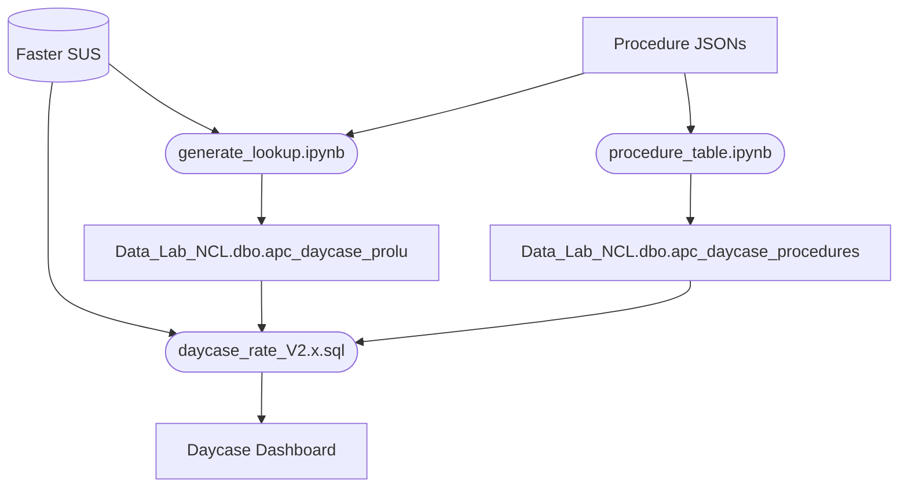

# dc_procedures: Daycase Procedure Lookup Generation
This repo contains the code to generate a procedure lookup table and the sql code to generate the output for the Daycase Rates Dashboard.

The purpose of the lookup table is to generate a map between Faster SUS rows and procedures according to the GIRFT definitions (where possible) and Model Hospital.

## Changelog

### [2.0] - 18/08/2023

- Initial version of the daycase_rates script that uses the procedure lookup table and Faster SUS
- Initial version of the procedure_table code to generate the Data_Lab_NCL.dbp.apc_daycase_procedures table
- Added lookup sql scripts to show basic usage of the procedure lookup table
- Added cg_gen script to generate formatted arrays of codegroups from the GIRFT pdf definitions

### [2.1] - 21/08/2023

- Added columns to implement the exclusion flags (WIP, current chemo and radiography procedures)

### [2.2] - 31/08/2023

- Added Exclusion procedures based on historic ad-hoc request

### [2.3] - 01/09/2023

- Aggregated main Day Case Rates SQL script for performance
- Commented out exclusion code for performance until requested

### [2.4] - 04/09/2023

- Added columns to process Elective activity and LOS 0-1 activity for DAX measures

## Design

*Flow of data and code*

## .env Settings

- FIN_YEAR: Specifies which Financial Years the lookup generator should consider during execution. A blank array implies all years.
- FIN_MONTH: Specifies which Financial Months (1 = April, etc.) the lookup generator should consider during execution. A blank array implies all months.
- PROCEDURES: Specifies which Procedures the lookup generator should consider during execution. The values should be the id_pro values as used in the procedure table (Data_Lab_NCL.dbo.apc_daycase_procedures). To note, the code will not check this table and will use whatever id mapping exists in the local JSON files. A blank array implies all procedures.
- SQL_ADDRESS: The server address to the MSSQL server. It is the **Server name:** parameter value when opening MS SQL Server Management Studio and getting the Connect to Server pop-up.
- SQL_DATABASE: SQL database to upload data to.
- SQL_SCHEMA: SQL schema to upload data to (typically dbo or a user BLUE id).
- SQL_TABLE: SQL table to upload data to.
- OUTPUT: Either "sql" or "csv". Determines how the generated lookup data will be output. If set to sql, the lookup data will be uploaded to SQL_DATABASE.SQL_SCHEMA.SQL_TABLE. If set to csv, the lookup data will be output to ./output/output.csv. csv mode is useful for large scopes as it bypasses the slow upload process but will delete exisiting data from the table from the same scope ahead of the manual upload to prevent duplication.
- SQL_PROC_TABLE: The output table for procedure_table.ipynb. It will use SQL_DATABASE and SQL_SCHEMA as specified above.

## generate_lookup.ipynb
Notebook to generate the lookup table to map patients to procedures according to the GIRFT standard

### Standard use:
- Set the .env file accordingly
- Run all cells in the notebook file

### Pseudocode:
- Get procedures objects from the JSON definitions
- For each procedure
  - Build a sql query to get all eIDs for this procedure from Faster SUS
  - Delete existing data from the sandpit table
  - Output the results

## procedure_table.ipynb
Notebook to generate the info table for procedures from derivisions from the JSON files in the /data/procedures/ directory

### Standard use:
- Set SQL_PROC_TABLE in the .env file
- Run all cells in the notebook file

### Pseudocode:
- Get all procedure objects from the JSON files
- Build a dataframe containing the information of each procedure
- Upload to the sandpit

## docs files
Files in the docs directory

### daycase_rates Vx.x.sql
Main sql script that is used as the input data for the Daycase Dashboard

### cg_gen.ipynb
Converts codegroups within the pdf GRIFT HVLC definitions into something I could copy and past into the codegroups.json

### lookup_base.sql
Demonstration on how to access data in the lookup table. Main consideration is accounting for overlap in the procedure definitions. Each procedure has a priority and only the lowest priority applicable procedure should be used.

### lookup_summary.sql
Script that shows the number of patients per procedure. Used for validation.

## License
This repository is dual licensed under the [Open Government v3](https://www.nationalarchives.gov.uk/doc/open-government-licence/version/3/) & MIT. All code can outputs are subject to Crown Copyright.
